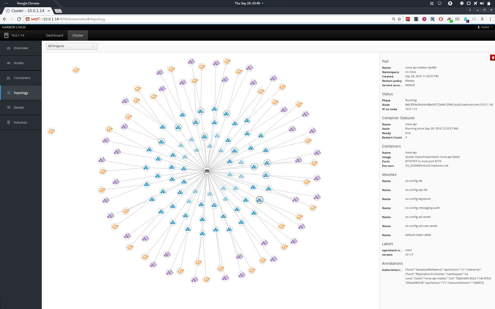
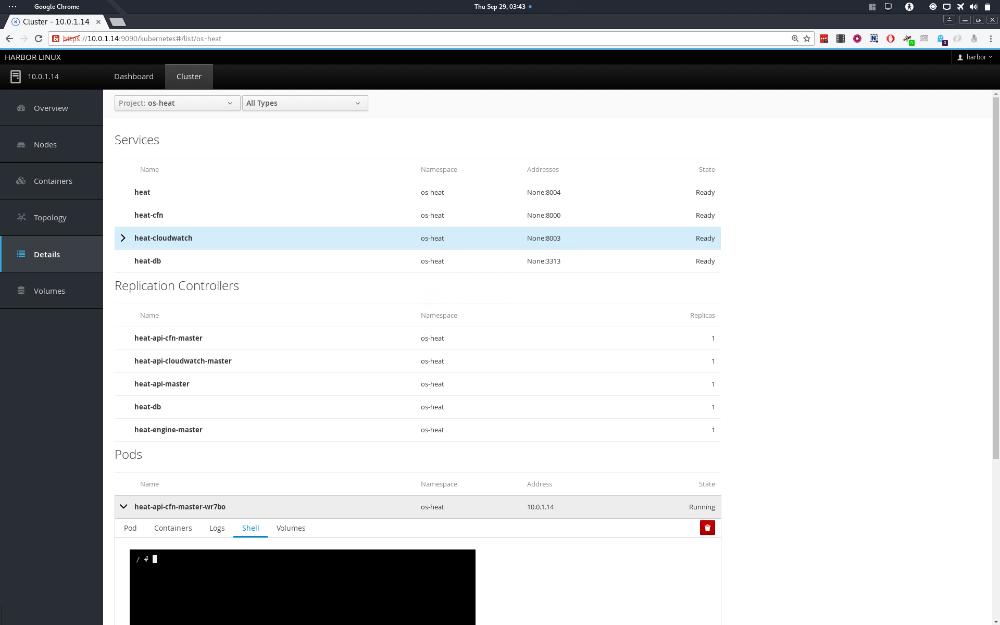
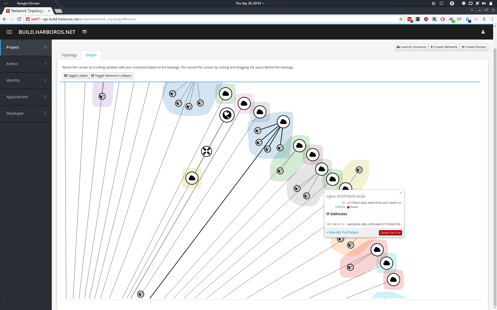
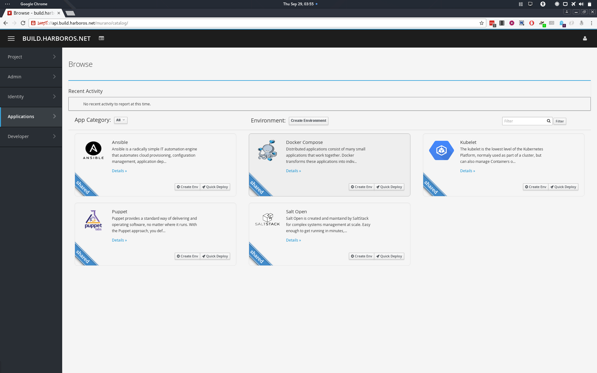

<p align="center">
  
</p>
# Harbor

Harbor is the Kubernetes, OpenStack, Atomic Linux and FreeIPA stack from port.direct.

Networking is provided by OVN from the [OpenvSwitch](https://github.com/openvswitch/ovs) project, improving both control and performance upon both the reference OpenStack and Kubernetes networking layers and allows seamless integration between the two platforms.
 * kube-proxy is replaced by neutron's LBaaS v2 service (HAProxy by default)
 * each node runs an uplink pod and ingress controller, in the host's network namespace to provide access to the cluster
 * every pod can run either in the host's network namespace or a neutron subnet, so the cloud can bootstrap itself and allow other services to continue operation even if Neutron/OVN goes down.
 * Cinder can be used for persistent storage for all components (databases etc), bar itself and keystone (requires manual config)


 This repo contains the Dockerfiles and build scripts for the Harbor platform containers and RPM-OSTREE repository (Used by Mandracchio), the [Mandracchio](https://github.com/portdirect/harbor/tree/latest/docker/mandracchio) contains the Build script for the Linux host, [Marina](https://github.com/portdirect/harbor/tree/latest/docker/marina) contains deployment script and helpers, while the [Intermodal](https://github.com/portdirect/intermodal) repo contains standardized container images for use within Harbor.

## Security

Harbor takes an extreme approach to security, in comparison with a typical OpenStack deployment:
 * All services run TLS both **internally**, and externally
 * All Databases use PKI authentication in addition to password auth, and all transport is encapsulated in TLS
 * Rabbitmq use PKI authentication and uses TLS for transport
 * Each service is on a separate network (Using Geneve for Tunneling/Encapsulation)
 * Each service/pod is protected by Neutron security groups that:
   * limit communication to within it's name-space for internal services
   * Permit ingress to endpoints from the user-facing load balancers only.
 * External access to the cluster is performed via Kubernetes Ingress Controllers, allowing simple enforcement of:
   * rate limiting
   * white/black listing
   * header stripping
 * All configuration params are salted,encrypted and accessed via FreeIPA's Vault API
 * All pods access their configuration paramiters via a read only bind mount, prepared via an init container.
  * This paves the way for all containers to launch with a read-only filesystem
 * End-User account details are held in FreeIPA, not Keystone, access and authentication is performed via SAML2 Federation.
   * This is currently a work in progress as users can still access OpenStack directly via a domain created for LDAP access to FreeIPA.


## Components

| Function      | Kube Component      | Harbor Notes                     | Status      |
|---------------|---------------------|----------------------------------|-------------|
| Storage       | flexvolume          | baremetal cinder driver          | Active      |
| Networking    | driver              | Kuryr CNI Driver                 | Active      |
|               | kube-proxy          | Neutron LBaaSv2                  | Active      |


| Function      | OpenStack Component | Harbor Notes                     | Network [1] | Status      |
|---------------|---------------------|----------------------------------|-------------|-------------|
| Identity      | Keystone            | With FreeIPA & Ipsilon           | Mixed [2]   | Active      |
| Secrets       | Barbican            | Backed by FreeIPA                | Neutron     | Active      |
| Block Storage | Cinder              | LVM Driver                       | Host        | Active      |
| Networking    | Neutron             | OVN                              | Host        | Active      |
|               | Designate (DNS)     | PowerDNS Backend                 | Neutron     | WIP         |
|               | Neutron LBaaS       | HAProxy                          | Neutron     | Active      |
|               | Kuryr               | Libnetwork Driver                | Host        | Active      |
|               | Kube CNI Driver     | Raven Python3 Prototype          | Host        | Active      |
| Compute       | Nova (docker)       | Native Cinder Support            | Mixed [3]   | Active      |
|               | Nova (KVM)          | Spice, NoVNC and Serial Consoles | Mixed [3]   | To Process  |
|               | Zun                 |                                  | Neutron     | WIP         |
| Orchestration | Heat                | Docker 1.12 support              | Neutron     | Active      |
|               | Murano              |                                  | Neutron     | Active      |
|               | Mistral             |                                  | Neutron     | Active      |
|               | Senlin              |                                  | Neutron     | WIP         |
|               | Magnum              |                                  | Neutron     | WIP         |


 1. Network the service runs in
 2. Dedicated Docker (native) Network for FreeIPA, Initial Keystone pod runs in host network namespace, subsequent pods run in Neutron
 3. API and Worker's in Neutron, Hypervisors in Host Network name-space

## Screenshots
 * Cockpit
 <div align="center">
         
         
         </img>
 </div>

 * Horizon
  <div align="center">
          
          
          </img>
  </div>

 * [Video of murano in action](https://github.com/HarborOS/videos/blob/master/horizon-placeholder.webm?raw=true)


## Getting Started

### Bare-metal:
  The easiest way to get going is to write the iso to a usb key:

``` Bash
#!/bin/bash
USB_KEY_DEV=null #!replace me!

DOCKER_IMAGE=port/mandracchio-installer:latest
IMAGE_NAME=harbor-host-7
IMAGE_ROOT=/srv/images/installer/images/images
COMPRESSED_IMAGE_LOC="${IMAGE_ROOT}/installer.iso"
DOCKER_CONTAINER=$(docker run -d --privileged -v /dev:/dev:rw ${DOCKER_IMAGE})
docker exec ${DOCKER_CONTAINER} /bin/sh -c "dd bs=4M if=${COMPRESSED_IMAGE_LOC} of=/dev/${USB_KEY_DEV} && sync"
docker rm -f ${DOCKER_CONTAINER}
```

From there you can install Harbor like any other CentOS based distro, with a few caveats:
 * You must create a "harbor" user, and add them to the docker group.
 * You cannot use xfs for the partition containing /var/lib/docker, unless you create it manually prior to starting docker with ftype enabled (this is already done for the cloud images)
 * You should set up NTP, and a single network interface with anaconda: this interface will subsequently always be renamed to 'eth0' even with predictable device naming active.


### Updating
 After the first boot its a good idea to update the host before proceeding, sudo to root and run:
 ``` Bash
 #!/bin/bash
 systemctl start docker
 harbor-master-host-update
 ```
 This will pull the rpm-ostree server image, start it and set up the host to use it as the remote, before running ```rpm-ostree upgrade```.

 If there are any updates applied, reboot the node and you should be good to go.


### Setting up harbor
The config files for harbor are kept in ```/etc/harbor```, you shouldn't need to touch any of them for a POC, but may want to set some passwords in ```harbor-auth.conf```, or adjust values in ```network.conf```, though the latter is quite fragile at the moment. One exception to this is 'os_domain' in ```network.conf```, which you will probably want to change from the default of 'novalocal'. The Kubelet image will run a docker container on the first start that runs through the config files and replaces values in the form ```{{ PASSWORD_[0-9][0-9] }}``` with an appropriate length string from pwgen.


### Starting harbor
First run the following commands:
```bash
#!/bin/bash
harbor-node-setup
systemctl start docker
systemctl enable docker
systemctl start kubelet
docker logs -f kubelet
# and then after kthe k8s api is up:
watch kubectl get --all-namespaces pods
```

Then set up your hosts file, or dns, to point to the host that harbor is running on, eg:
```bash
#!/bin/bash
HARBOR_HOST_IP=10.0.1.17
OS_DOMAIN=novalocal #Or whatever you changed it to.

cat >> /etc/hosts << EOF
${HARBOR_HOST_IP} ipsilon.${OS_DOMAIN}
${HARBOR_HOST_IP} api.${OS_DOMAIN}
${HARBOR_HOST_IP} keystone.${OS_DOMAIN}
${HARBOR_HOST_IP} neutron.${OS_DOMAIN}
${HARBOR_HOST_IP} ovn.${OS_DOMAIN}
${HARBOR_HOST_IP} nova.${OS_DOMAIN}
${HARBOR_HOST_IP} metadata.${OS_DOMAIN}
${HARBOR_HOST_IP} serial.${OS_DOMAIN}
${HARBOR_HOST_IP} glance.${OS_DOMAIN}
${HARBOR_HOST_IP} glance-registry.${OS_DOMAIN}
${HARBOR_HOST_IP} cinder.${OS_DOMAIN}
${HARBOR_HOST_IP} heat.${OS_DOMAIN}
${HARBOR_HOST_IP} heat-cfn.${OS_DOMAIN}
${HARBOR_HOST_IP} heat-cloudwatch.${OS_DOMAIN}
${HARBOR_HOST_IP} murano.${OS_DOMAIN}
${HARBOR_HOST_IP} freeipa.${OS_DOMAIN}
${HARBOR_HOST_IP} ipa-crl.${OS_DOMAIN}
${HARBOR_HOST_IP} portal.${OS_DOMAIN}
${HARBOR_HOST_IP} gnocchi.${OS_DOMAIN}
${HARBOR_HOST_IP} grafana.${OS_DOMAIN}
${HARBOR_HOST_IP} ceilometer.${OS_DOMAIN}
${HARBOR_HOST_IP} zun.${OS_DOMAIN}

${HARBOR_HOST_IP} ipsilon.os-ipsilon.svc.${OS_DOMAIN}
${HARBOR_HOST_IP} api.os-api.svc.${OS_DOMAIN}
${HARBOR_HOST_IP} keystone.os-keystone.svc.${OS_DOMAIN}
${HARBOR_HOST_IP} neutron.os-neutron.svc.${OS_DOMAIN}
${HARBOR_HOST_IP} ovn.os-ovn.svc.${OS_DOMAIN}
${HARBOR_HOST_IP} nova.os-nova.svc.${OS_DOMAIN}
${HARBOR_HOST_IP} metadata.os-nova.svc.${OS_DOMAIN}
${HARBOR_HOST_IP} serial.os-nova.svc.${OS_DOMAIN}
${HARBOR_HOST_IP} glance.os-glance.svc.${OS_DOMAIN}
${HARBOR_HOST_IP} glance-registry.os-glance.svc.${OS_DOMAIN}
${HARBOR_HOST_IP} cinder.os-cinder.svc.${OS_DOMAIN}
${HARBOR_HOST_IP} heat.os-heat.svc.${OS_DOMAIN}
${HARBOR_HOST_IP} heat-cfn.os-heat.svc.${OS_DOMAIN}
${HARBOR_HOST_IP} heat-cloudwatch.os-heat.svc.${OS_DOMAIN}
${HARBOR_HOST_IP} murano.os-murano.svc.${OS_DOMAIN}
${HARBOR_HOST_IP} portal.os-portal.svc.${OS_DOMAIN}
${HARBOR_HOST_IP} gnocchi.os-gnocchi.svc.${OS_DOMAIN}
${HARBOR_HOST_IP} grafana.os-gnocchi.svc.${OS_DOMAIN}
${HARBOR_HOST_IP} ceilometer.os-ceilometer.svc.${OS_DOMAIN}
${HARBOR_HOST_IP} zun.os-zun.svc.${OS_DOMAIN}
EOF
```
After the "marina-master" pod is running, you can log into the cockpit dashboard @ https://$HARBOR_HOST_IP:9090, or you can enter it using:
```bash
#!/bin/bash
marina
```
Commands of interest in this container are (using keystone as an example):
* ```journalctl --unit harbor-*.service ``` get the logs for the services.
* ```systemctl [status|restart] harbor-keystone.service``` get status or restart the service, services should be started in order initially (see "/start.sh") but can be restarted in any order once they have all come up, currently only one service should be restarting at any one time, as FreeIPA gets upset when we are logging in an out from multiple containers at the same time - a good thing usually.

* ```harbor-service-edit-auth keystone```, loads the keystone vars used to populate secrets from its vault into vi for editing, before saving it back to the vault.

Now you are in the marina-master container you should start the Harbor OpenStack Services:
```bash
#!/bin/bash
HARBOR_SERVICE_LIST="harbor-memcached.service \
                    harbor-messaging.service \
                    harbor-ipsilon.service \
                    harbor-keystone.service \
                    harbor-api.service \
                    harbor-neutron.service \
                    harbor-glance.service \
                    harbor-cinder.service \
                    harbor-nova.service \
                    harbor-heat.service \
                    harbor-mistral.service \
                    harbor-murano.service \
                    harbor-magnum.service \
                    harbor-metering.service \
                    harbor-portal.service"
start_systemd_harbor_service () {
  SYSTEMD_SERVICE=$1
  systemctl enable ${SYSTEMD_SERVICE}
  systemctl start ${SYSTEMD_SERVICE}
}
for HARBOR_SERVICE in ${HARBOR_SERVICE_LIST}; do
  start_systemd_harbor_service ${HARBOR_SERVICE}
done
```

One of the main consumers of time can be waiting for enough entropy for FreeIPA. Running a few noisy commands like "```ls -lahR / &```" a few times can speed things up quite a bit.
It is also worth checking out what the master freeipa-server container is up to (currently, this is launched by a pod that binds to the docker socket, but will soon be a petset):

```bash
#!/bin/bash
docker logs -f freeipa.${OS_DOMAIN}
```
Once you are in the cockpit dashboard, check out the systemd services tab, and logs to monitor the OpenStack services being set up. If you want to manage the host that cockpit is running on with cockpit you will need to add it to the dashboard, you need to enter the IP of the host that's already active on the dashboard, which will then open an ssh connection to the host...

Once all services are reported as started, you want to enroll the host to FreeIPA by running:
```bash
#!/bin/bash
harbor-ipa-client-install
```
It typically takes about an hour and a half to get here on an Intel Xeon 1230, 32GB, SSD, 150Mbs(Cable modem - UK).

Now restart the node, once it has come back up run ```docker info``` if it has an entry like: ```etcd://etcd.os-etcd.svc.${OS_DOMAIN}:4001``` then you are ready to actually start harbor for real:

```bash
#!/bin/bash
systemctl enable kubelet
systemctl start kubelet
docker logs -f kubelet
# and then after the k8s api is up:
watch kubectl get --all-namespaces pods
```
After about another 15 mins or so all services should be up and running.

Sometimes the raven service gets out of sync, due to the large number of namespaces present when it first comes up, this will be fixed ASAP, but for now you may need to run the following a few times:
```bash
#!/bin/bash
kubectl delete -f /etc/harbor/marina/raven/controllers.yaml
kubectl create -f /etc/harbor/marina/raven/controllers.yaml
```

### Usage
You can find the FreeIPA User Credentials in the now updated ```/etc/harbor/harbor-auth.conf```
The FreeIPA UI is available at: ```https://freeipa.${OS_DOMAIN}/ipa/ui/```

The Ipsilon UI is available at: ```https://ipsilon.${OS_DOMAIN}/idp```

Credentials for the default domain (ie services) can be got from the marina container and running the ```harbor-service-auth-edit``` for a service.
The Horizon Dashboard is available at: ```https://api.${OS_DOMAIN}/```

You should be able to log in using federation via the 'hostadmin' and 'useradmin' accounts. The 'admin' account will not work, as it is members of groups that do not have mirrored projects and roles created in keystone, this creates a situation that requires you to clear your cookies manually, as Ipsilon will attempt to log you out of keystone which is not possible if you didn't log in... You should, however, be able to log in via the ${OS_DOMAIN} using normal keystone auth.
